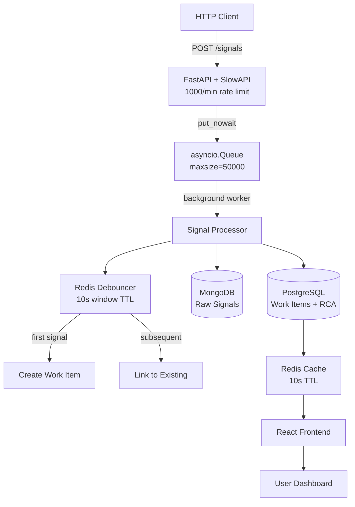

# Zeotap Incident Management System (IMS)

Production-grade incident management system with backpressure, debouncing, state machine, and real-time dashboard.

## Architecture



## Quick Start

```bash
git clone https://github.com/YOUR_USERNAME/zeotap-ims
cd zeotap-ims
docker-compose up -d
```

- Frontend: http://localhost:3000
- Backend API: http://localhost:8000
- API Docs: http://localhost:8000/docs

## Backpressure Strategy

Why this matters: When the database is slow or failing, signals pile up in memory rather than blocking HTTP handlers.

**Implementation:**
- **Bounded Queue:** `asyncio.Queue(maxsize=50000)` as buffer between HTTP and DB
- **Non-blocking Ingestion:** HTTP uses `put_nowait()` → returns `202 Accepted` immediately
- **Background Consumer:** Single worker drains queue at database speed
- **Queue Full Handling:** When queue reaches 50k capacity, new signals are dropped with counter increment

**Design Decision:** Dropping signals is preferable to cascading failure. System availability > perfect data.

**Monitoring:** Queue depth exposed via `/health` and `/signals/metrics`

## Design Patterns

### State Pattern (Work Item Lifecycle)

Used for incident workflow: `OPEN → INVESTIGATING → RESOLVED → CLOSED`

**Why State Pattern?**
- Encapsulates transition rules per state (prevents illegal transitions)
- Easy to add new states (e.g., POST_MORTEM, WAITING_APPROVAL)
- Each state object handles its own valid events
- Centralizes state logic instead of scattered if-else statements

### Strategy Pattern (Alerting)

| Component | Strategy | Action |
|-----------|----------|--------|
| RDBMS_PRIMARY, API_GATEWAY | P0Strategy | Page everyone, create war room |
| MCP_HOST_01, ASYNC_QUEUE | P1Strategy | Page on-call engineer only |
| CACHE_CLUSTER | P2Strategy | Slack notification only |

**Why Strategy Pattern?**
- Decouples alert logic from incident creation
- New strategies can be added without modifying core code
- Runtime selection based on component/severity

## Tech Stack

| Component | Technology | Why This vs Alternatives |
|-----------|-----------|--------------------------|
| Backend | FastAPI + Python | Async native, auto-OpenAPI docs, Pydantic validation |
| Queue | asyncio.Queue | Native Python, no extra dependencies, bounded size |
| Raw Signals | MongoDB | Schema-flexible, high write throughput |
| Work Items | PostgreSQL | ACID transactions, SELECT FOR UPDATE |
| Cache/Debounce | Redis | Atomic TTL operations, sub-millisecond latency |
| Frontend | React + Vite | Fast refresh, component reusability |
| Container | Docker Compose | Single command dev environment |

## Testing

### Unit Tests
```bash
cd backend
pytest tests/ -v
# Expected: 14 passed
```

### Simulation Script
```bash
cd backend
python scripts/simulate_failure.py
```

Simulates RDBMS outage cascade:
- Phase 1: 120 signals for RDBMS_PRIMARY → 1 work item (debounced)
- Phase 2: 50 signals for MCP_HOST_01 → 1 work item created
- Phase 3: 20 signals for CACHE_CLUSTER → 1 work item created

### Manual API Testing
```bash
# Send signal (returns 202)
curl -X POST http://localhost:8000/signals \
  -H "Content-Type: application/json" \
  -d '{"component_id": "TEST", "error_type": "TEST", "severity": "P1"}'

# Check health
curl http://localhost:8000/health

# View metrics
curl http://localhost:8000/signals/metrics

# List incidents
curl http://localhost:8000/work-items
```

## API Endpoints

| Method | Endpoint | Rate Limit | Description |
|--------|----------|------------|-------------|
| POST | /signals | 1000/min | Ingest signal (backpressure enabled) |
| GET | /signals/metrics | None | Queue depth, throughput, drops |
| GET | /signals/recent | None | Last 50 signals for live feed |
| GET | /work-items | None | List all incidents (cached 10s) |
| GET | /work-items/{id} | None | Incident details + linked signals |
| POST | /work-items/{id}/transition | None | State change (event param) |
| POST | /work-items/{id}/rca | None | Submit RCA (validation enforced) |
| GET | /health | None | Per-component status + metrics |

## Non-Functional Features

| Feature | Implementation | Purpose |
|---------|---------------|---------|
| Rate Limiting | SlowAPI, 1000 requests/minute per IP | Prevents API abuse |
| Retry Logic | Exponential backoff: 3 attempts (0.5s → 1s → 2s) | Resilient DB writes |
| Redis Cache | Dashboard cache with 10s TTL | Reduces PostgreSQL load |
| Docker Health Checks | pg_isready, mongosh ping, redis-cli ping | Services healthy before backend starts |
| CORS | Allow localhost:3000 | Frontend-backend communication |

## Project Structure

```
zeotap-ims/
├── backend/
│   ├── app/
│   │   ├── api/           # Signals + incidents endpoints
│   │   ├── core/          # Queue, debouncer, state machine, retry, alert strategy
│   │   ├── db/            # MongoDB, PostgreSQL, Redis clients
│   │   ├── models/        # Pydantic schemas (RCA, work item)
│   │   └── main.py        # FastAPI app with CORS + rate limiter
│   ├── tests/             # 14 unit tests (RCA, state machine, debouncer)
│   ├── scripts/           # Simulation script (RDBMS cascade)
│   └── requirements.txt
├── frontend/
│   └── src/
│       ├── components/    # LiveFeed, IncidentList, IncidentDetail, RCAForm
│       └── App.jsx
└── docker-compose.yml
```

## Author

**Name:** Akshat Singh
**Role:** Infrastructure/SRE Intern Applicant — Zeotap
**Date:** May 2026